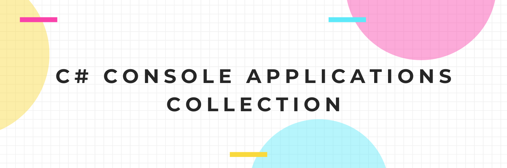

<h3 align="center">
    
</h3>

<h3 align="center">
    This repository contains a collection of C# console applications that I have created. These applications were built using Visual Studio and the .NET framework.
</h3>

  
  

-------------

<!-- ## Table of Contents
- [Applications](https://github.com/xiacodes/CSharp-Console-Apps/edit/main/README.md#applications)
- [How to Run](https://github.com/xiacodes/CSharp-Console-Apps/edit/main/README.md#how-to-run) 

------------- -->

## Applications

  <table>
    <thead>
      <tr>
        <th>Application Name</th>
        <th>Description</th>
        <th>Link to Code</th>
      </tr>
    </thead>
    <tbody>
      <tr>
        <td>HelloWorld</td>
        <td>A basic &quot;Hello World&quot; program to ensure the development environment is set up correctly.</td>
        <td align="center"><a href="https://github.com/xiacodes/CSharp-Console-Apps/tree/main/CSharp-Console-Apps/CSharp-Console-Apps/HelloWorld">Link</a></td>
      </tr>
      <tr>
        <td>Calculator</td>
        <td>A simple calculator that performs addition, subtraction, multiplication, and division.</td>
        <td align="center"><a href="https://github.com/xiacodes/CSharp-Console-Apps/tree/main/CSharp-Console-Apps/CSharp-Console-Apps/Calculator">Link</a></td>
      </tr>
      <tr>
        <td>TemperatureConverter</td>
        <td>A program that converts a temperature in Fahrenheit to Celsius.</td>
        <td align="center"><a href="https://github.com/xiacodes/CSharp-Console-Apps/tree/main/CSharp-Console-Apps/CSharp-Console-Apps/TemperatureConverter">Link</a></td>
      </tr>
      <tr>
        <td>InterestCalculator</td>
        <td>A program that calculates the simple interest on a loan.</td>
        <td align="center"><a href="https://github.com/">Link</a></td>
      </tr>
      <tr>
        <td>GradeCalculator</td>
        <td>A program that calculates the letter grade of a student based on their percentage score.</td>
        <td align="center"><a href="https://github.com/">Link</a></td>
      </tr>
      <tr>
        <td>ArraySumCalculator</td>
        <td>A program that calculates the sum of an array of integers.</td>
        <td align="center"><a href="https://github.com/"><del>Link</del></a></td>
      </tr>
    </tbody>
  </table>

## How to Run
To run any of these console applications, follow these steps:
- Download or clone this repository to your local machine.
- Open the solution file (.sln) in Visual Studio.
- Select the console application you want to run.
- Press F5 or select "Debug" > "Start Debugging" to build and run the application.
- Follow the instructions displayed in the console window.
- That's it! You can now explore and run these C# console applications in your local development environment.
